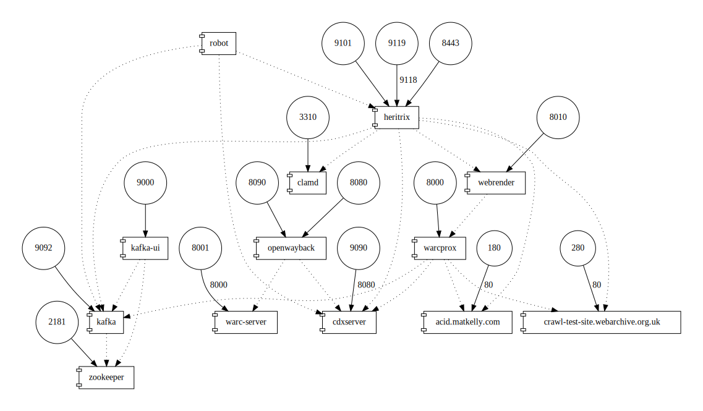

UKWA Heritrix
=============

This repository takes [Heritrix3](https://github.com/internetarchive/heritrix3) and adds in code and configuration specific to the UK Web Archive. It is used to build a Docker image that is used to run our crawls.

Local Development
-----------------

If you are modifying the Java code and want to compile it and run the unit tests, you can use:

    $ mvn clean install

However, as the crawler is a multi-component system, you'll also want to run integration tests.

Continuous Integration Testing
------------------------------

All tags, pushes and pull-requests on the main `ukwa-heritrix` repository will run integration testing before pushing an updated Docker container image. See the workflows [here](../../actions).

However, it is recommended that you understand and run the integration tests locally first.

Local Integration Testing
-------------------------

The supplied Docker Compose file can be used for local testing. This looks quite complex because the system spins up many services, including ones that are only needed for testing:

- The main crawler, and associated services:
  - ClamD for virus scanning,
  - WebRender API and Warcprox for browser-based crawler integration.
  - An OutbackCDX server for recording crawled URLs with timestamps and checksums for deduplication.
  - An Apache Kafka topic/log server, and its associated Zookeeper instance.
- Two test websites for running test crawls without touching the live web:
  - A container that simulates http://acid.matkelly.com/
  - A container that hosts a crawler test site at http://crawl-test-site.webarchive.org.uk (this is not a working public URL)
- A local Wayback service for inspecting the results:
  - this talks to the crawler's CDX server, 
  - and is assisted by a `warc-server` container that makes the crawled WARCs available.
- A `robot` container that uses the Python [Robot Framework](https://robotframework.org/) to run some integration tests.

__IMPORTANT__ there is a `.env` file that `docker-compose.yml` uses to pick up shared variables. This includes the user UID that is used to run the services. This should be overridden using whatever UID you develop under. e.g.

    $ export CRAWL_UID=$(id -u)

There's a little helper script to do this, which you can run like this before running Docker operations:

    $ source source-setup-crawl-uid.sh

To run the tests locally, build the images:

    $ docker-compose build

This builds the `heritrix` and `robot` images. 

Note that the Compose file is set up to pass the `HTTP_PROXY` and `HTTPS_PROXY` environment variables through to the build environment, so as long as those are set, it should build behind a corporate web proxy. If you are not behind a proxy, and these variables are not set, `docker-compose` will warn that the variables are not set, but the build should work nevertheless.

To run the integration tests:

    $ docker-compose up

Alternatively, to launch the crawler for manual testing, use e.g. (listing `heritrix warcprox webrender` we make sure we see logs from those three containers):

    $ docker-compose up heritrix warcprox webrender

and use a secondary terminal to e.g. launch crawls. Note that `ukwa-heritrix` is configured to wait a few seconds before auto-launching the `frequent` crawl job.

After running tests, it's recommended to run:

    $ docker-compose rm -f
    $ mvn clean

This deletes all the crawl output and state files, thus ensuring that subsequent runs start from a clean slate.

### Service Endpoints

Once running, these are the most useful services for experimenting with the crawler itself:

| Service  |  Endpoint                                                         | Description                                 |
| -------- | ----------------------------------------------------------------- | ------------------------------------------- |
| Heritrix | https://localhost:8443/ (username/password `heritrix`/`heritrix`) | The main Heritrix crawler control interface. |
| Kafka UI | http://localhost:9000/ | A browser UI that lets you look at the Kafka topics. |
| Crawl CDX | http://localhost:9090/ | An instance of OutbackCDX used to record crawl outcomes for analysis and deduplication.  Can be used to look up what happened to a URL during the crawl. |
| Wayback | http://localhost:8080/ | An instance of OpenWayback that allows you to play back the pages that have been crawled. Uses the Crawl CDX to look up which WARCs hold the required URLs. |

Note that the [Heritrix REST API documentation](https://heritrix.readthedocs.io/en/latest/api.html) contains some useful examples of how to interact with Heritrix using `curl`.

There are a lot of other services, but these are largely intended for checking or debugging:

| Service  |  Endpoint                                                         | Description                                 |
| -------- | ----------------------------------------------------------------- | ------------------------------------------- |
| Heritrix (JMX) | localhost:9101 | Java [JMX](https://docs.oracle.com/javase/tutorial/jmx/overview/index.html) service used to access internal state for monitoring the Kafka client. (DEPRECATED) |
| Heritrix (Prometheus) | http://localhost:9119/ | Crawler bean used to collect crawler metrics and publish them for Prometheus |
| More TBA |

### Manual testing

The separate [crawl-streams](https://github.com/ukwa/crawl-streams) utilities can be used to interact with the logs/streams that feed URLs into the crawl, and document the URLs found and processed by the crawler.  To start crawling the two test sites, we use:

    $ docker run --net host ukwa/crawl-streams submit -k localhost:9092 fc.tocrawl -S http://acid.matkelly.com/
    $ docker run --net host ukwa/crawl-streams submit -k localhost:9092 fc.tocrawl -S http://crawl-test-site.webarchive.org.uk/

Note that the `--net host` part means the Docker container can talk to your development machine directly as `localhost`, which is the easiest way to reach your Kafka instance.

The other thing to note is the `-S` flag - this indicates that these URLs are seeds, and that means when the crawler pickes them up, it will widen the scope of the crawl to include any URLs that are on those sites (strictly, those URLs that have this URL as a prefix when expressed in SURT form. Without the `-S` flag, submitted URLs will be ignored unless they are within the current crawler scope.

Note, however, some extra URLs may be discovered during processing that are necessary for `in scope` URLs to work (e.g. images, CSS, JavaScript etc.). The crawler is configured to fetch these even if they are out of the main crawl scope. i.e. the crawl scope is intended to match up with the HTML pages that are of interest. Any further resources required by those changes will be added if the crawler determines they are needed.

#### Directly interacting with Kafka

It's also possible to interact directly with Kafka by installing and using the standard Kafka tools. This is not recommended at present, but these instructions are left here in case they are helpful:

    cat testdata/seed.json | kafka-console-producer --broker-list kafka:9092 --topic fc.tocrawl
    kafka-console-consumer --bootstrap-server kafka:9092 --topic fc.tocrawl --from-beginning
    kafka-console-consumer --bootstrap-server kafka:9092 --topic fc.crawled --from-beginning

### Automated testing

The `robot` container runs test crawls over the two test sites mentioned in the previous section. The actions and expected results are in the [crawl-test-site.robot](integration-test/robot/tests/crawl-test-site.robot) test specification. 
    
Crawl Configuration
-------------------

We use [Heririx3 Sheets](https://heritrix.readthedocs.io/en/latest/configuring-jobs.html#sheets-site-specific-settings) as a configuration mechanism to allow the crawler behaviour to change based on URL SURT prefix.

Summary of Heritrix3 Modules
----------------------------

Modules for Heritrix 3.4.+

* AnnotationMatchesListRegexDecideRule: DecideRule for checking against annotations.
* AsynchronousMQExtractor: publishes messages to an external queue for processing.
* ClamdScanner: for processing in an external ClamAv daemon.
* CompressibilityDecideRule: REJECTs highly-compressible (and highly incompressible) URIs.
* ConsecutiveFailureDecideRule: REJECTs a URI if both it and its referrer's HTTP status codes are >= 400.
* CountryCodeAnnotator: adds a country-code annotation to each URI where present.
* ExternalGeoLookup: implementation of ExternalGeoLookupInterface for use with a ExternalGeoLocationDecideRule; uses MaxMind's [GeoLite2](http://dev.maxmind.com/geoip/geoip2/geolite2/) database.
* ExtractorJson: extracts URIs from JSON-formatted data.
* ExtractorPattern: extracts URIs based on regular expressions (written explicitly for one site; not widely used).
* HashingCrawlMapper: intended as a simpler version of the HashCrawlMapper using the Hashing libraries.
* IpAnnotator: annotates each URI with the IP.
* ViralContentProcessor: passes incoming URIs to ClamAv.
* WARCViralWriterProcessor, XorInputStream: workarounds for force-writing of 'conversion' records based on XORed version of the original data.
* RobotsTxtSitemapExtractor: Extracts and enqueues sitemap links from robots.txt files.
* WrenderProcessor: Runs pages through a web-rendering web service rather than the usual H3 processing.

Release Process
---------------

We only need tagged builds, so

    mvn release:clean release:prepare

is sufficient to tag a version and initiate a Docker container build.  Note that the SCM/git tag should be of the form X.Y.Z.

Redis Notes
-----------

Some experimental code uses a Redis back end. This should support multiple implementations, but subtleties around transactions, distribution, and syntax remain.

e.g. [KvRocks](https://github.com/KvrocksLabs/kvrocks) is great but does not support things like [ZADD with LT](https://redis.io/commands/ZADD#zadd-options). The `LT` option was added recently (Redis 6.2), so does not have wide support elsewhere. Consider using two ops instead.

Changes
-------

* 2.7.11:
    * Based on Heritrix 3.4.0-20210621
    * ...
* 2.7.0-BETA:
    * Update Heritrix3 to version based on BDB-JE 7.
    * Stop using addPersistentDataMapKey because it's been removed from H3.
* 2.6.10:
    * Allow switch to Bloom filter unique URI approach based on environment variable.
    * Switch OutbackCDX client POST to using HttpClient.
    * Default to not checking system properties for the OutbackCDX HttpClient builder.
    * Ensure HTTPClient response entities get consumed.
    * Add Prometheus metrics for OutbackCDX client requests.
* 2.6.9:
    * Ensure quota resets get propagated to pre-requisites and redirects, for #50.
* 2.6.8:
    * Switch back to server quotas as the default.
* 2.6.7:
    * Avoid collecting source stats as this is causing problems arising from #49.
* 2.6.6:
    * Ensure `SourceTag` does not get set to `null` in `RobotsTxtSitemapExtractor` (#49)
    * Modify logger to allow some buffering rather than flushing every line.
* 2.6.5:
    * Realised critical data fields like launchTimestamp were not marked to perist in the disk cache! This was causing crawls to fail under load when items are swapped out before swapping back in for the fetch.
* 2.6.4:
    * Added optional refreshDepth field, which marks the number of hops for which the launchTimestamp will be marked as an inherited field.
* 2.6.3:
    * Handle case where emitting inscope URIs with no source by using self as source.
* 2.6.2:
    * Rely on Crawler Commons more so it handles site-maps of different formats.
    * Update to commons-io 2.4 across the whole project (to make sure Crawler Commons is happy).
    * Don't assume a Sitemap from robots.txt is definitely a sitemap as there could be redirects. See #44.
    * Handle case where incoming non-seed URIs were not getting logged right because the inscope log builder assumes there is a source CrawlURI.
    * Allow up to 50,000 outlinks per CrawlURI, to cope with the case of large sitemaps.
* 2.6.1:
    * Modify disposition processor so robots.txt cache does not get trashed when robots.txt get discovered outside of pre-requisites and ruled out-of-scope.
    * Update to OutbackCDX 0.5.1 requirement, taking out hack needed to cope with URLs with * in (see https://github.com/nla/outbackcdx/issues/14)
* 2.6.0:
    * Sitemap extraction and simple integration with re-crawl mechanism.
* 2.5.2:
    * Revert to skipping whole disposition chain as robots.txt cache was getting trashed by -5000 responses.
* 2.5.1:
    * Make number of WARC writers configurable (as 5 was a bottleneck under DC).
* 2.5.0:
    * Simplify shutdown logic to avoid lock files lingering.
    * Allow over-quota queues to be retired and re-awakened instead of emitting all.
    * Skip to disposition processor rather than skipping the whole chain, so the recrawl delay get set right.
* 2.4.15:
    * Fix Spring syntax problem.
* 2.4.14:
    * Attempt checkpoint during Docker shutdown.
    * Allow WebRender maxTries to be configured. 
* 2.4.13:
    * Make WebRender timeouts configurable, and use WEBRENDER as the default prefix.
    * Emit in-scope URLs into a separate Kafka topic.
* 2.4.12:
    * Only reset sheets if the sheets are being modified, to allow simple 'refresh' requests.
* 2.4.11:
    * Copy the sheets so they 'stick' even if we change the targetSheet.
* 2.4.10:
    * Ensure sheets are unchanged if unspecified.
* 2.4.9:
    * Refactor and simplify RecentlySeen code and default to ignoring forceFetch. Can override obeyForceFetch, but the behaviour we want is to force the CrawlURI to be accepted into the frontier even if it's already there (so it can be re-prioritised). We don't want forceFetch to override RecentlySeen in that case.
* 2.4.8:
    * Reset sheet definitions for recrawl delays, as launchTimestamp resolves the issue.
* 2.4.7:
    * Update to Heritrix 3.4.0-20190418 (and so avoid caching DNS failures for ever)
    * Make startup support none or new-crawl as well as resume-latest.
* 2.4.6:
    * Ensure critical tasks are handled before skipping the disposition chain.
    * Allow per-URL override of sheet-based launchTimestamp, consistently named. 
* 2.4.5:
    * Switch to generic per-launch sheet setup. i.e. 'target sheets' where any property can be set.
    * Create sheet for every target, set launchTimestamp that way.
    * Switch to hostMaxSuccessKb rather than serverMaxSuccessKb because clearing server quotas was brittle across HTTP/HTTPS.
* 2.4.4:
    * Add ability to skip the disposition chain if it's a recently-seen URI and hence out of scope.
    * Make WebRender more patient.
    * Renamed Metrics Bean so it's clear it's about Prometheus.
* 2.4.3:
    * Allow alert count to be monitored via Prometheus.
    * Log known issue with pre-0.5.1 OutbackCDX URL handling when there's an asterisk.
* 2.4.2:
    * Revert to Heritrix 3.4.0-20190207 rather than trialing 3.4.0-SNAPSHOT.
* 2.4.1:
    * Switch to clearing host quotas rather than server quotas.
    * Add DOI.org as a known URL shortener (i.e. always resolve via)
    * Restore URL shorteners list.
* 2.4.0:
    * Allow use of launch timestamp to control re-crawls. 
    * Process error outlinks (because WebRendered come back as 'error code' -5002), and make WebRendered items clear. 
    * Ensure critical pre-requisites are not blocked by the quotas, because quotas are only cleared when the seeds go through.
* 2.3.6:
    * Revert to server quota, and avoid messing with frontier groups.
* 2.3.5:
    * Use and clear host quotas instead, to avoid http/https problem. 
* 2.3.4:
    * Support NOT routing via Kafka properly.
    * Simplify sheet logic layout.
* 2.3.3:
    * Make operation of quota reset clear. 
    * Give H3 time to start up. 
* 2.3.2:
    * Use consistent envvar name for Web Render config.
    * Use newer webrender-api service in docker-compose file.
    * Slashes not allowed in WARC prefix for warcprox. Removed them.
    * Update to Java 8 on Travis
* 2.3.1:
    * Store WebRender WARCs next to the normal ones -- Didn't work, see 2.3.2.
    * Update build to Java 8 in Maven.
    * Update pre-send scoping logic to match candidates processor. 
    * Reducing logging of forgetting URLs. 
* 2.3.0:
    * Switching to a 'forgetful' URI filter, BdbUriUniqFilter plus ForgettingFrontierProcessor.
    * Switch to using an annotation for quota resets. 
    * Now running with Puppeteer as an alternative renderer 
    * Shift quota-reset into a processor.
    * Ensure sheets are applied if post-filtering. 
    * Always get embeds.
* 2.2.20:
    * Shorten recrawl periods somewhat, to attempt to avoid issues with crawls being skipped.
    * Ensure resetting quotas avoids any possible race condition. 
* 2.2.19:
    * Docker build rely on Maven to handle H3 version etc. 
    * Allow OSSRH Snapshots. 
    * Assemble Heritrix from Maven. 
    * Experiment with a snapshot build and only core repos.
* 2.2.18:
     * Fix NPW in WebRender numTries check.
* 2.2.17:
     * Update to 3.4.0-20190207 H3 build.
     * Make it possible to disable outgoing logs. 
     * Shifting to 3.4 H3 release. 
* 2.2.16:
     * Use IA SNAPSHOT binary release.
     * Update WebRenderCount annotation properly. 
* 2.2.15:
     * Switch to using the term WebRender rather than Wrender.
     * Simplify web renderer to allow H3 to handle retries properly.
     * Add an explicit client id to the Kafka client.
     * Name Prometheus metric consistently.
* 2.2.14:
     * Apply sheets to HTTPS and HTTP. 
* 2.2.13:
     * Try alternate quota reset logic.
     * Ensure Kafka offsets get committed properly.
     * Switch to keeping all checkpoints by default, to avoid messing with log files.
* 2.2.12:
     * Ensure unique groupId per consumer, as required for manual partition in Kafka.
* 2.2.11:
    * Add job-resume command. 
    * Use latest ukwa/heritrix version.
    * Always resume rather than launching without a checkpoint.
    * Ensure we use the local SNAPSHOT build. 
    * Store checkpoints in the state folder to make sure they get kept.
    * Avoid using disposition lock unnecessarily. 
    * Add standard Heritrix crawl metrics to the Prometheus exporter bean. 
    * Add roofinglines host to polite list following CAS-1113711-Y8R9
    * Use explicit flag to indicate that quotas should be reset.
* 2.2.10:
    * Don't skip revisits when looking up in OCDX, as this allowed heavy re-crawling of popular URLs.
* 2.2.9:
    * Add an 'excludes' watched file.
    * Use tally mechanism to reset quotas.
    * Use threadsafe queues branch of H3.
* 2.2.8:
    * Attempt thread-safe quota resets.    
* 2.2.7:
    * Make OutbackCDX connection pool size configurable.
* 2.2.6:
    * Modified quota reset logic.
* 2.2.5:
    * Stop WebRender treating data URIs as a serious problem.
* 2.2.4:
    * Format surt files correctly (use newline).
    * Disposition lock around stats reset.
* 2.2.3:
    * Use watched file as per #17, log discarded URLs. 
    * Fix over-prioritisation of inferred urls. 
    * Add Prometheus Metrics bean.
    * Allow separation of candidate URLs.
    * Update GeoIP and add Prometheus dependencies.
* 2.2.2:
     * Add more detail to logging for virus scanner issues.
     * Lock the frontier while enqueuing to avoid NPE, see #16
* 2.2.1:
     * Modifications to Kafka assignment handling and add SEEK_TO_BEGINNING control
* 2.2.0:
    * Make state re-usable between launches.
    * Manually assign Kafka partitions.
* 2.1.15:
    * Add experimental JMX -> Prometheus hook. 
    * Allow max.poll.records overrides. 
* 2.1.14:
    * Avoid checking OutbackCDX for already-rejected URIs. 
* 2.1.13:
    * Remove monitor process that seems unstable on GlusterFS. 
* 2.1.12:
    * Tunable message handler thread pool size. 
    * Using multithreaded message processing to ease OutbackCDX bottleneck. 
* 2.1.11:
    * Also avoid null host bad URIs. 
* 2.1.10:
    * Also avoid sending problematic URLs to OutbackCDX if present. 
    * Discard unwanted and malformed URLs. 
* 2.1.9:
    * Avoid overwriting seekToBeginning before the seeking has been done. 
* 2.1.8:
    * Cleaner behaviour for stop/start of Kafka hook. 
    * Add scripts to examine the H3 service. 
* 2.1.7:
    * Make GEOIP_LOOKUP_EVERY_URI an option. 
    * Avoid passing all URIs through GeoIP check if it won't change the result
    * Tuneable Kafka behaviour. 
* 2.1.6:
    * Tidy up blockAll a bit. 
* 2.1.5:
    * Allow pause/resume to work as expected. 
* 2.1.4:
    * DNS results keyed consistently with hosts. 
* 2.1.3:
    * Scope decision recording made optional, and added more consistent naming.
* 2.1.2:
    * Extended DecideRuleSequence to record the decisive rule. 
* 2.1.1:
    * Added ability to log discarded URLs, and fixed a serious bug in URL routing
* 2.1.0:
    * Recently Seen functionality moved to a DecideRule, allowing us to use Heritrix's `recheckScope` feature to prevent recrawling of URLs that have been crawled since the original request was enqueued.
    * The OutbackCDXRecentlySeenDecideRule implementation also stores the last hash, so the `OutbackCDXPersistLoadProcessor` is no longer needed.
* 2.0.0:
    * Switched to Recently Seen unique URI filter, backed by OutbackCDX.
